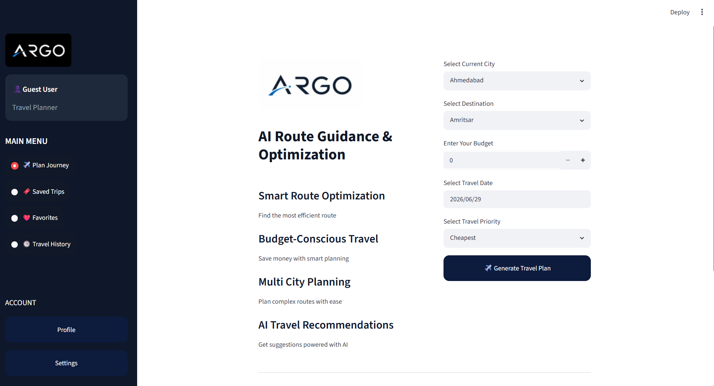
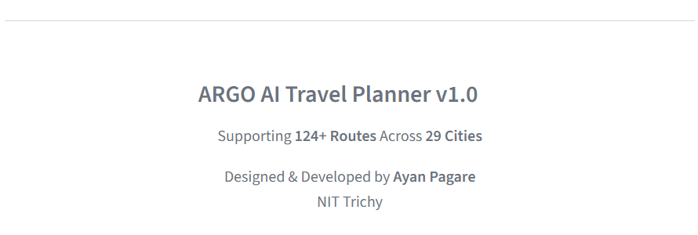
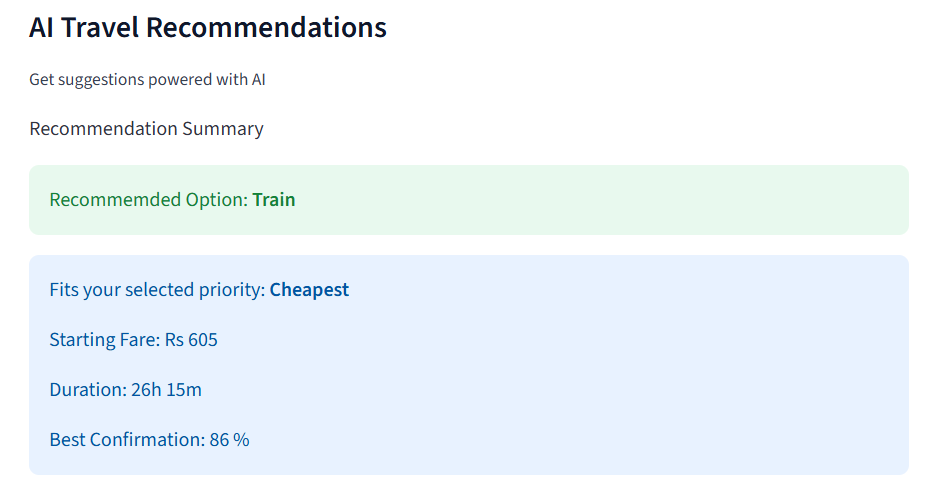
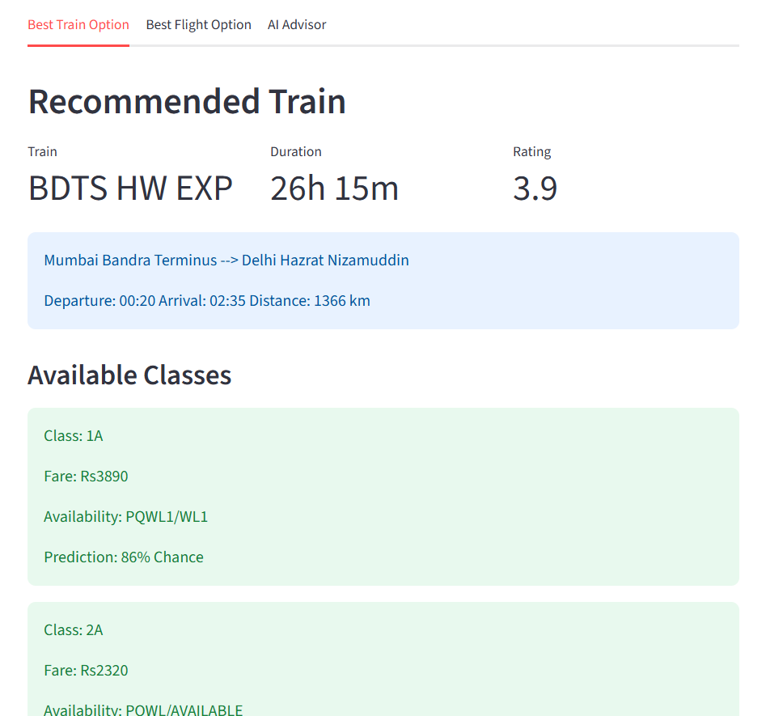
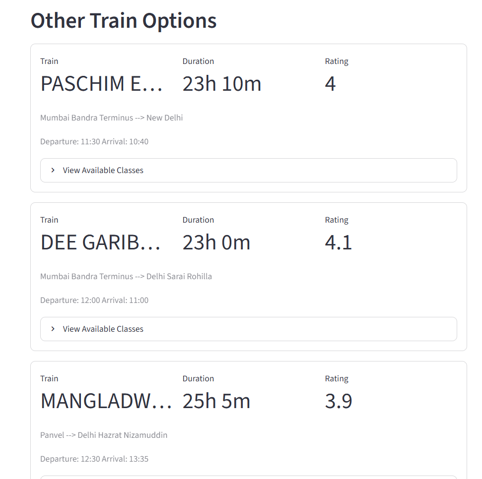
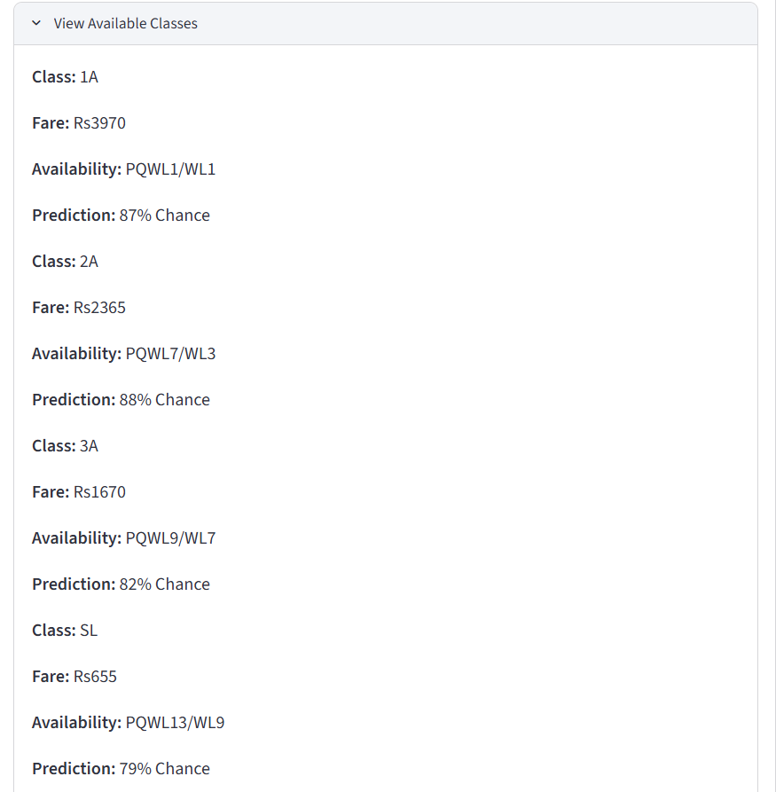
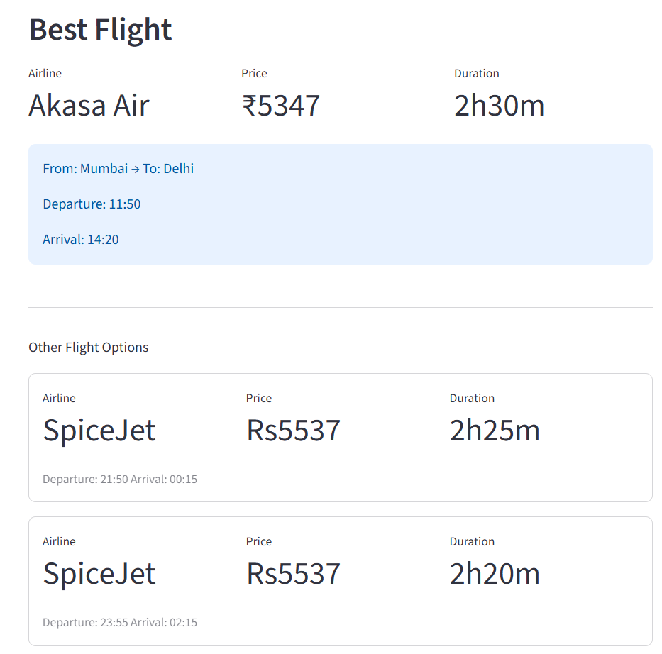
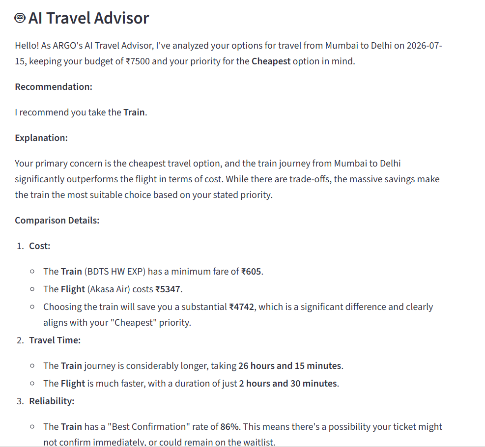

# ✈️ ARGO : AI Route Guidance & Optimization

### AI-Powered Smart Travel Planner

Compare trains and flights in real time and receive AI-powered travel recommendations based on price, travel time, and ticket confirmation probability.


---

## 🚧 Project Status

ARGO is currently under active development.

The current version includes live train and flight comparison with AI-powered travel recommendations.

Upcoming versions will include:

- 🏨 Hotel Recommendations
- 🗺️ Google Maps Integration
- 📈 Fare Prediction
- 👤 User Authentication
- 💾 Saved Trips
- 🤖 Smarter AI Recommendations

---

## 📌 Overview

Planning travel often involves switching between multiple platforms to compare train availability, flight fares, travel time, ticket confirmation chances, and overall cost.

ARGO simplifies this process by bringing everything together into a single AI-powered application.

Using live train and flight data along with Google's Gemini AI, ARGO compares available travel options and recommends the most suitable journey based on the user's selected priority.

Whether your goal is to save money, reach your destination faster, or maximize the chances of getting a confirmed train ticket, ARGO provides a unified travel planning experience.

---

## ✨ Features

- 🚆 Live Train Search
- ✈️ Live Flight Search
- 🤖 AI-powered Travel Recommendations (Google Gemini)
- 💰 Cheapest Route Recommendation
- ⚡ Fastest Route Recommendation
- 🎯 Highest Confirmation Probability Recommendation
- 📊 Side-by-side Travel Comparison
- 🇮🇳 Designed for Indian Domestic Travel

---

## 🛠 Tech Stack

| Category | Technologies |
|----------|--------------|
| **Programming Language** | Python |
| **Frontend** | Streamlit |
| **AI Model** | Google Gemini 2.5 Flash |
| **Train Data** | IRCTC RapidAPI |
| **Flight Data** | Sky Scrapper RapidAPI |
| **Configuration** | Python-dotenv, Streamlit Secrets |
| **Version Control** | Git & GitHub |
| **Deployment** | Streamlit Community Cloud |

---

## 📂 Project Structure

```
ARGO/
│
├── app.py                 # Main Streamlit application
├── flight_search.py       # Flight API integration
├── config.py              # API key management
├── requirements.txt       # Project dependencies
├── README.md              # Project documentation
├── .gitignore
└── assets/                # Images, screenshots and diagrams
```
---

## ⚙️ Installation

Clone the repository

```bash
git clone https://github.com/YOUR_GITHUB_USERNAME/ARGO.git
```

Navigate into the project

```bash
cd ARGO
```

Install dependencies

```bash
pip install -r requirements.txt
```

Create a `.env` file

```env
Gemini_API_Key=YOUR_GEMINI_API_KEY
RapidAPI_Key=YOUR_TRAIN_API_KEY
Flight_RapidAPI_Key=YOUR_FLIGHT_API_KEY
```

Run the application

```bash
streamlit run app.py
```

## 📸 Screenshots

### 🏠 Home




---

### 🚆 Results







---

### 🤖 AI Recommendation



---

---

# 🏗️ System Architecture

```
                    User
                      │
                      ▼
             Streamlit Frontend
                      │
                      ▼
           Travel Planning Engine
                      │
      ┌───────────────┼────────────────┐
      ▼               ▼                ▼
 Train Search     Flight Search    AI Advisor
 (IRCTC API)      (SkyScrapper)    (Gemini)
      │               │                │
      └───────────────┼────────────────┘
                      ▼
          Comparison & Decision Engine
                      │
                      ▼
       Best Route Recommendation Output
```
---

# 🚀 Future Roadmap

The following features are planned for future releases:

- 🏨 Hotel Recommendation Engine
- 🗺️ Google Maps Integration
- 📍 Nearby Attractions
- 🌦️ Weather Forecast Integration
- 📈 Fare Prediction using Machine Learning
- 👤 User Authentication
- 💾 Saved Trips & History
- 📱 Mobile Responsive Interface
- 🌍 International Travel Support

---

# 👨‍💻 Author

## Ayan Pagare

Production Engineering Undergraduate  
National Institute of Technology Tiruchirappalli (2025-2029)

### Connect with me

- LinkedIn:[Ayan Pagare] (https://www.linkedin.com/in/ayan-pagare-75a96437b)
- GitHub: [Ayan Pagare] (https://github.com/AyanPagare)

---

## 📄 License

This project is licensed under the MIT License.

See the [LICENSE](LICENSE) file for more details.